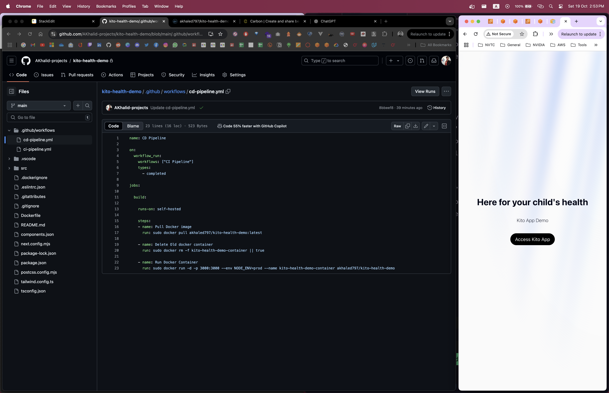
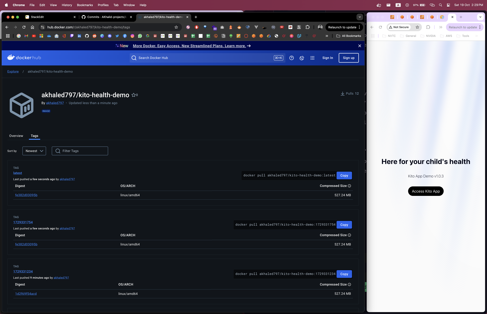
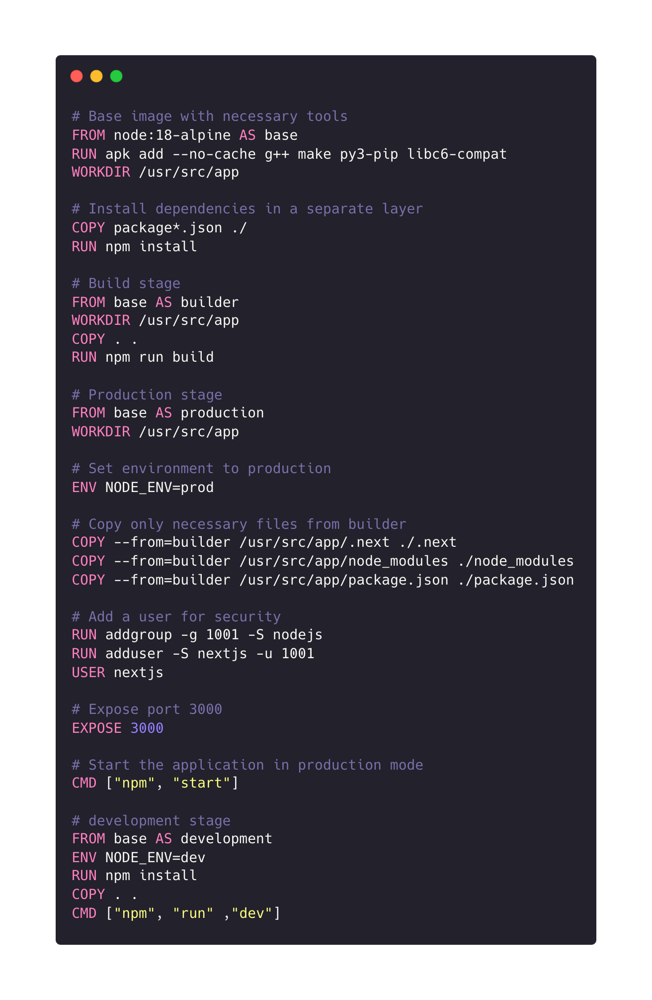

# Optimizing React App Deployment with Docker and GitHub Actions

This is a small walk through of the process of Dockerizing a React app and implementing a CI/CD pipeline using GitHub Actions to automate the build and deployment process.

Initial Commit of the App


App after Implementing Ci CD Pipelines "version text change"


## Dockerizing the React App

Below is a reusable Dockerfile tailored for a React application:

### Dockerfile




```dockerfile
# Base image with necessary tools
FROM node:18-alpine AS base
RUN apk add --no-cache g++ make py3-pip libc6-compat
WORKDIR /usr/src/app

# Install dependencies in a separate layer
COPY package*.json ./
RUN npm install

# Build stage
FROM base AS builder
WORKDIR /usr/src/app
COPY . .
RUN npm run build

# Production stage
FROM base AS production
WORKDIR /usr/src/app

# Set environment to production
ENV NODE_ENV=prod

# Copy only necessary files from builder
COPY --from=builder /usr/src/app/.next ./.next
COPY --from=builder /usr/src/app/node_modules ./node_modules
COPY --from=builder /usr/src/app/package.json ./package.json

# Add a user for security
RUN addgroup -g 1001 -S nodejs
RUN adduser -S nextjs -u 1001
USER nextjs

# Expose port 3000
EXPOSE 3000

# Start the application in production mode
CMD ["npm", "start"]

# development stage
FROM base AS development
ENV NODE_ENV=dev
RUN npm install 
COPY . .
CMD ["npm", "run" ,"dev"]
```

### Explanation of the Dockerfile

1. **Base Image**: The Dockerfile starts from a lightweight Node.js base image with necessary build tools installed.
2. **Build Stages**: It defines multiple stages:
   - **Builder Stage**: Installs dependencies and builds the production-ready version of the app.
   - **Production Stage**: Sets up the environment for production and exposes the necessary port.
   - **Development Stage**: Allows for development mode with hot reloading.

## GitHub Actions for CI/CD

To automate the deployment process, we can set up GitHub Actions to handle Continuous Integration (CI) and Continuous Deployment (CD).

### CI Pipeline Configuration (ci-pipeline.yml)

The CI pipeline builds the Docker image and pushes it to Docker Hub upon code changes in the main branch.


```yaml
name: CI Pipeline

on:
  push:
    branches: [ "main" ]
  pull_request:
    branches: [ "main" ]

jobs:

  build:
    runs-on: ubuntu-latest

    steps:
    - uses: actions/checkout@v4

    - name: Set up Docker tag
      run: echo "IMAGE_TAG=$(date +%s)" >> $GITHUB_ENV

    - name: Login Dockerhub
      env:
        DOCKER_USERNAME: ${{secrets.DOCKER_USERNAME}}
        DOCKER_PASSWORD: ${{secrets.DOCKER_PASSWORD}}
      run: docker login -u $DOCKER_USERNAME -p $DOCKER_PASSWORD
    
    - name: Build the Docker image
      run: docker build . --file Dockerfile --tag akhaled797/kito-health-demo:${{ env.IMAGE_TAG }}

    - name: Push to Dockerhub
      run: docker push akhaled797/kito-health-demo:${{ env.IMAGE_TAG }}

    - name: Tag and push the image as 'latest'
      run: |
        docker tag akhaled797/kito-health-demo:${{ env.IMAGE_TAG }} akhaled797/kito-health-demo:latest
        docker push akhaled797/kito-health-demo:latest
```

### CD Pipeline Configuration (cd-pipeline.yml)

The CD pipeline pulls the latest image and deploys it to a self-hosted runner (AWS EC2).


```yaml
name: CD Pipeline

on:
  workflow_run:
    workflows: ["CI Pipeline"]
    types:
      - completed

jobs:

  build:

    runs-on: self-hosted

    steps:
    - name: Pull Docker image
      run: sudo docker pull akhaled797/kito-health-demo:latest
      
    - name: Delete Old docker container
      run: sudo docker rm -f kito-health-demo-container || true
      
    - name: Run Docker Container
      run: sudo docker run -d -p 3000:3000 --env NODE_ENV=prod --name kito-health-demo-container akhaled797/kito-health-demo
```

### Explanation of the CI/CD Workflows

- **CI Pipeline**:
  - Triggers on pushes and pull requests to the main branch.
  - Builds the Docker image and pushes it to Docker Hub.
  - Tags the latest image for easier access.

- **CD Pipeline**:
  - Triggers when the CI pipeline completes successfully.
  - Pulls the latest Docker image, removes any existing container, and runs a new instance of the app.


## AWS Infrastructure

To set up the necessary infrastructure for deploying the React app, follow these steps to create a Virtual Private Cloud (VPC) and configure related resources:

1. **Create a VPC**
   - **Name**: `kito-vpc`
   - This VPC will provide a secure and isolated network for your resources.

2. **Set Up an Internet Gateway**
   - **Name**: `KitoIGW`
   - Attach the Internet Gateway to `kito-vpc` to allow internet access.

3. **Create a Subnet**
   - **Name**: `Kito Public Subnet`
   - This subnet will host the EC2 instance and allow it to communicate with the internet.

4. **Configure a Route Table**
   - **Name**: `Kito Public Route Table`
   - Associate this route table with the `Kito Public Subnet`.
   - Add a route directing traffic to the Internet Gateway (`KitoIGW`) to enable internet access for instances in this subnet.

5. **Create a Security Group**
   - **Name**: `KitoSG`
   - Define inbound rules for the following ports:
     - **22**: SSH (for remote access)
     - **80**: HTTP (for web traffic)
     - **443**: HTTPS (for secure web traffic)
     - **3000**: Custom port (for the React app)

6. **Launch an EC2 Instance**
   - **Name**: `kito-demo`
   - Choose an Ubuntu image for the instance.
   - Assign the instance to the `Kito Public Subnet` and associate it with `KitoSG` for security.

7. **Establish SSH Connection**
   - Connect to the `kito-demo` instance via SSH to perform the necessary installations.

8. **Install Required Software**
   - Install **Docker** for container management.
   - Install **Nginx** to serve as a reverse proxy for your application.
   - Set up the **GitHub Actions runner agent** on the EC2 instance to automate CI/CD workflows.

9. **Configure Nginx**
   - Route traffic to the Docker container by adding a `proxy_pass` directive in the Nginx configuration, directing traffic to the container's IP address. This allows Nginx to forward requests to the running React application.

---


## Conclusion

By Dockerizing your React app and implementing a CI/CD pipeline with GitHub Actions, you can automate the deployment process, ensuring consistency across different environments. This setup allows you to focus on development while automating the deployment of your application to production. 

---

Thank you for reading!